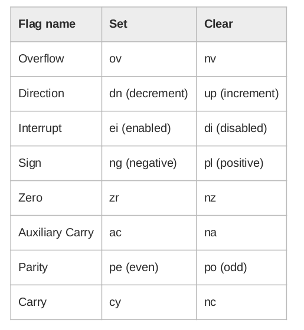

# TIPS

* 注意段间的数据覆盖问题

   各个段间的地址是紧密相邻的,并且8086中是没有人为我们管理内存的,如果没有定义data segment(或定义了一个空的),修改ds:00直接等于修改cs:00.这也是造成跑飞的原因之一.

* ds,cs等不仅要在assume中设置,还要使用mov显式赋值 
    但是不要设置ss.这里可能是因为支持多proc声明的原因吧,非常反人类.

* $符号

    这个符号一般用在变量定义或者符号定义中，表示当前即将分配的数据在当前段的偏移地址。详情见教材p72面。

* loop指令
    loop并不好用，特别是在多重循环的时候。

* 根据两个数的带小来跳转
    注意区分有符号和无符号数。对应的指令不同(ja,jb;jg,jl)

# flags

# problems

* 为什么声明在data segment中的变量却无法通过debug中查看data segment观察到?